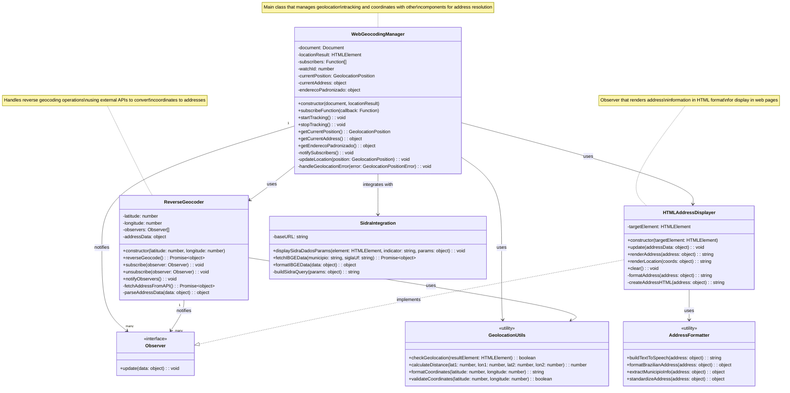

# Guia.js Class Diagram

This diagram shows the main classes and their relationships in the guia.js library for geolocation and address management.

## Class Descriptions

### WebGeocodingManager
The main orchestrator class that manages geolocation tracking, coordinates with reverse geocoding services, and notifies subscribers of location updates. It integrates with browser geolocation APIs and manages the application's location state.

### ReverseGeocoder  
Handles the conversion of latitude/longitude coordinates to human-readable addresses using external geocoding APIs. Implements the Observer pattern to notify other components when address data is available.

### HTMLAddressDisplayer
An Observer implementation that renders address information in HTML format for display in web applications. It formats and presents location data in a user-friendly way.

### GeolocationUtils
Utility class providing common geolocation operations like distance calculations, coordinate validation, and geolocation capability checks.

### AddressFormatter
Utility class for formatting address data, including Brazilian address standardization and text-to-speech preparation for location information.

### SidraIntegration
Handles integration with Brazil's IBGE SIDRA API for demographic and statistical data about municipalities, complementing location information with population and area statistics.