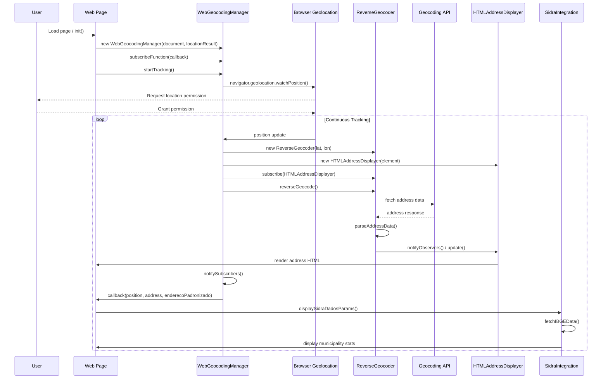
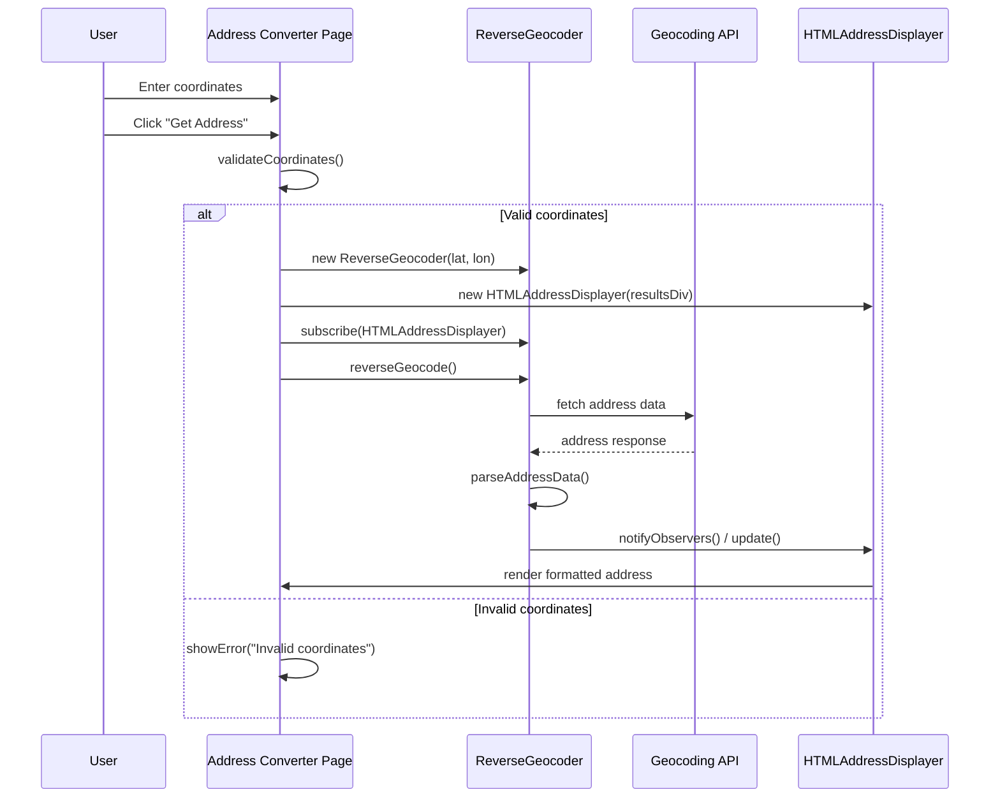
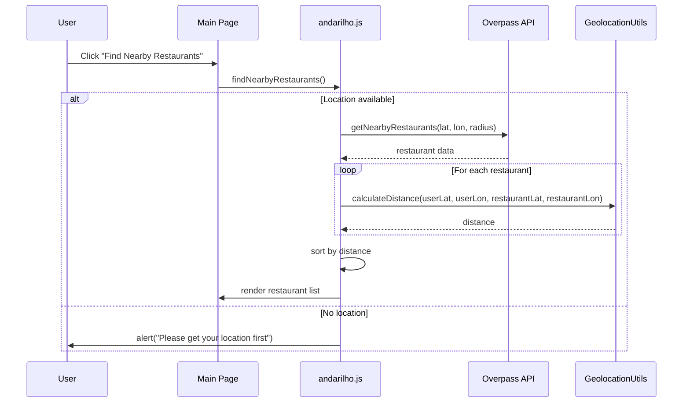
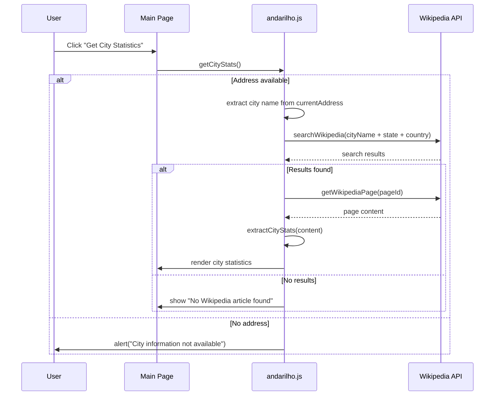
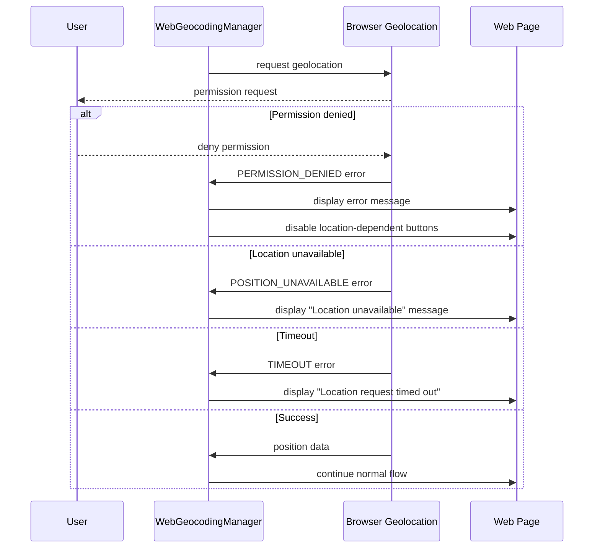

# Guia.js Sequence Diagrams

This document contains sequence diagrams showing the typical workflows in the guia.js geolocation system.

## Location Tracking Workflow

## Address Conversion Workflow

## Restaurant Finding Workflow

## City Statistics Workflow

## Error Handling Workflow

## Key Workflow Patterns

### Observer Pattern
The system extensively uses the Observer pattern:
- `ReverseGeocoder` notifies observers when address data is ready
- `WebGeocodingManager` notifies subscribers when location updates occur
- `HTMLAddressDisplayer` implements the Observer interface to update UI

### Asynchronous Operations
All external API calls are asynchronous:
- Geolocation API calls use callbacks/promises
- Reverse geocoding API calls return promises
- Wikipedia and Overpass API calls are async/await based

### Error Handling Strategy
The system implements comprehensive error handling:
- Geolocation errors are categorized and user-friendly messages displayed
- API failures are caught and gracefully handled
- Input validation prevents invalid API calls

### Integration Points
The system integrates with multiple external services:
- Browser Geolocation API for location tracking
- Geocoding APIs for address resolution
- IBGE SIDRA API for Brazilian municipality statistics
- Wikipedia API for city information
- Overpass API for nearby places/restaurants