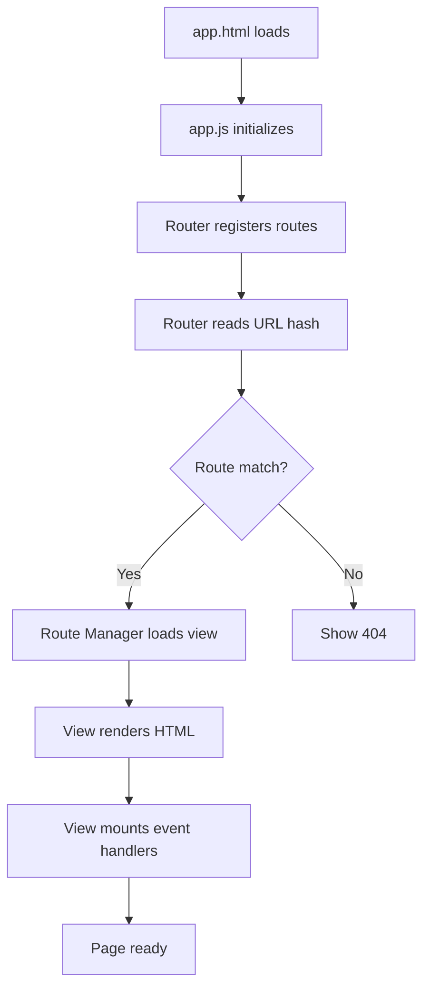

# SPA Migration Guide - Phase 1 Complete

## Overview

Phase 1 of the Single Page Application (SPA) migration has been completed. The application now has a modern SPA architecture while maintaining backward compatibility with the original multi-page structure.

## What Was Created

### Core SPA Infrastructure

1. **Router (`src/router.js`)**
   - Hash-based routing (#/) for zero server configuration
   - Route registration with dynamic parameters support
   - Browser history integration (back/forward buttons work)
   - 404 handling
   - Navigation guards (beforeEach/afterEach hooks)

2. **Route Manager (`src/route-manager.js`)**
   - View lifecycle management (mount/cleanup)
   - Dynamic CSS loading per route
   - Loading states and error boundaries
   - Screen reader announcements for navigation
   - Smooth scrolling with reduced motion support

3. **App Shell (`src/app.html`)**
   - Main SPA entry point
   - Common CSS loaded once
   - Navigation bar with hash links
   - Accessibility features (skip links, ARIA labels)
   - Noscript fallbacks

4. **App Entry Point (`src/app.js`)**
   - Route configuration
   - View registration
   - Navigation guard setup
   - Global error handling

### Views

All views are modular ES6 modules in `src/views/`:

1. **Home View (`src/views/home.js`)** - Main landing page
   - Geolocation features
   - Restaurant finder
   - City statistics

2. **Converter View (`src/views/converter.js`)** - Coordinate converter
   - Latitude/longitude to address conversion
   - Form validation
   - Nominatim API integration

3. **Tracking View (`src/views/tracking.js`)** - Real-time location tracking
   - Continuous location monitoring
   - Speech synthesis
   - Chronometer

## Architecture

```
src/
├── app.html              # SPA entry point (NEW)
├── app.js                # SPA initialization (NEW)
├── router.js             # Hash-based router (NEW)
├── route-manager.js      # View lifecycle manager (NEW)
├── views/                # View modules (NEW)
│   ├── home.js           # Home page view
│   ├── converter.js      # Converter view
│   └── tracking.js       # Tracking view
├── index.html            # OLD - Still works during migration
├── loc-em-movimento.html # OLD - Still works during migration
├── address-converter.html# OLD - Still works during migration
└── [shared CSS/JS files] # Shared across old and new
```

## Routes

| Route | View | Description |
|-------|------|-------------|
| `#/` | Home | Main landing page with geolocation |
| `#/converter` | Converter | Coordinate to address conversion |
| `#/tracking` | Tracking | Real-time location tracking |

## How to Use

### Accessing the SPA

1. Open `app.html` in a web browser
2. Navigate using the top navigation bar
3. Direct links: `app.html#/`, `app.html#/converter`, `app.html#/tracking`

### Browser Support

- **Chrome/Edge**: Full support (last 2 versions)
- **Firefox**: Full support (last 2 versions)
- **Safari**: Full support (last 2 versions)
- **Mobile browsers**: Full support (iOS Safari, Chrome Mobile)

### Development Server

To test locally:

```bash
cd src
python3 -m http.server 8080
# Open http://localhost:8080/app.html
```

## Key Features

### ✅ Hash-based Routing
- No server configuration needed
- Works on any static host (Cloudflare Pages, GitHub Pages, etc.)
- Bookmarkable URLs

### ✅ Backward Compatibility
- Old pages (`index.html`, etc.) still work
- 2-week migration window as planned
- No breaking changes

### ✅ Mobile-First Design
- Responsive layout
- Touch-friendly (48px minimum touch targets)
- Works on all screen sizes

### ✅ Accessibility
- WCAG 2.1 AA compliance
- Screen reader support
- Keyboard navigation
- ARIA labels and live regions
- Skip links

### ✅ Performance
- Lazy loading of views
- CSS loaded per route
- Preconnect hints for external APIs
- Reduced motion support

### ✅ Error Handling
- Global error boundaries
- Route-specific error states
- User-friendly error messages
- Reload/retry options

## Navigation Flow



## View Lifecycle

Each view follows this lifecycle:

1. **Render**: Generate HTML (pure, no side effects)
2. **Mount**: Initialize event handlers, API calls, etc.
3. **Active**: View is displayed, user interacts
4. **Cleanup**: Remove event listeners, stop API calls, free resources
5. **Unmount**: View is removed from DOM

## Migration Checklist

### Phase 1 ✅ Complete
- [x] Create router with hash-based navigation
- [x] Create route manager for view lifecycle
- [x] Create app shell (app.html)
- [x] Extract home view
- [x] Extract converter view
- [x] Extract tracking view
- [x] Test navigation
- [x] Verify old pages still work

### Phase 2 (Next Steps)
- [ ] Add navigation animations
- [ ] Implement view transitions
- [ ] Add loading skeletons
- [ ] Optimize performance (preloading)
- [ ] Add service worker for offline support

### Phase 3 (Future)
- [ ] Remove old HTML files
- [ ] Update all documentation
- [ ] Update deployment configuration
- [ ] Update test suite
- [ ] Performance audit

## Testing

### Manual Testing

1. **Navigation**
   ```
   ✓ Click navigation links
   ✓ Use browser back button
   ✓ Use browser forward button
   ✓ Direct URL navigation (app.html#/converter)
   ✓ Bookmark and return
   ```

2. **Views**
   ```
   ✓ Home view loads correctly
   ✓ Converter view loads correctly
   ✓ Tracking view loads correctly
   ✓ All buttons work
   ✓ Forms submit correctly
   ```

3. **Accessibility**
   ```
   ✓ Tab navigation works
   ✓ Screen reader announces navigation
   ✓ Skip links work
   ✓ Focus indicators visible
   ```

4. **Performance**
   ```
   ✓ Initial load is fast
   ✓ Navigation is instant
   ✓ No layout shifts
   ✓ Smooth scrolling
   ```

### Browser Testing

Test in:
- Chrome/Edge (desktop)
- Firefox (desktop)
- Safari (desktop)
- Chrome (mobile)
- Safari (iOS)

### Automated Testing

To be implemented in Phase 2:
- Unit tests for router
- Unit tests for route manager
- Integration tests for views
- E2E tests with Selenium

## Known Issues

### Issue 1: View Script Loading
The tracking view loads `loc-em-movimento.js` dynamically, which expects certain global variables. May need refactoring.

**Status**: Works but not optimal  
**Fix**: Phase 2 - refactor into proper ES6 modules

### Issue 2: Cache Management
Cache display is per-view, not shared across SPA lifecycle.

**Status**: Minor  
**Fix**: Phase 2 - centralize cache management

## API Compatibility

All external APIs remain the same:
- ✅ IBGE/SIDRA API
- ✅ Nominatim (OpenStreetMap)
- ✅ Wikipedia API
- ✅ Overpass API

## Browser Console

Useful debugging:

```javascript
// Access router
window.__router.getCurrentRoute()

// Access route manager
window.__routeManager.getCurrentView()

// Navigate programmatically
window.__router.navigate('/converter')

// Go back
window.__router.back()
```

## File Size Impact

| File | Size | Type |
|------|------|------|
| router.js | ~6 KB | New |
| route-manager.js | ~7 KB | New |
| app.js | ~3 KB | New |
| home.js | ~9 KB | New |
| converter.js | ~14 KB | New |
| tracking.js | ~5 KB | New |
| **Total** | **~44 KB** | Unminified |

After minification and gzip: ~12-15 KB estimated

## Version Update

Updated app version to **0.3.0** to reflect SPA migration milestone.

## Next Steps

1. **Test thoroughly** - Try all features in new SPA
2. **Gather feedback** - Identify any issues
3. **Monitor performance** - Check Core Web Vitals
4. **Plan Phase 2** - Implement enhancements

## Support

For issues or questions, refer to:
- `COPILOT_INSTRUCTIONS.md` - Development guidelines
- `HTML_CSS_JS_SEPARATION.md` - Architecture principles
- `REFERENTIAL_TRANSPARENCY.md` - Code organization

---

**Migration Status**: ✅ Phase 1 Complete  
**Date**: 2026-01-02  
**Version**: 0.3.0
